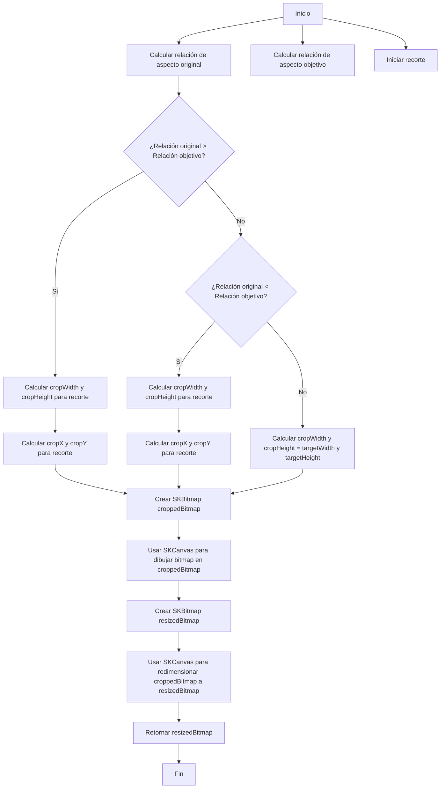

# Blazor WebAssemby .NET 9

> Blazor WebAssembly Standalone App

### Folder Structure
```
MyBlazorApp/
├── wwwroot/
│   ├── css/
│   │   └── app.css
│   └── index.html
├── Pages/
├── _Imports.razor
├── App.razor
├── MainLayout.razor
├── package.json
├── postcss.config.js
├── Program.cs
├── package.json
├── README.md
└── tailwind.config.js
```

### Config Error
```
<Nullable>enable</Nullable>
<TreatWarningsAsErrors>true</TreatWarningsAsErrors>

use http:
```

# Taildwind in .NET
## 1st Option
* [Tildwind CLI](https://tailwindcss.com/docs/installation) and go to standalone executable
* [Tildwind CLI](https://tailwindcss.com/blog/standalone-cli) and go to standalone CLI build
* [Git Repo Tildwind CLI](https://github.com/tailwindlabs/tailwindcss/releases/tag/v3.4.17) and download tailwindcss-windows-x64.exe
* Move the exe to the project
* Execute the exe on CMD
```
tailwindcss-windows-x64.exe init
```
* Config tailwind.config.js
```
module.exports = {
  content: [
    "./**/*.{razor,html,cshtml}"
  ],
  theme: {
    extend: {},
  },
  plugins: [],
}
```
* Add /wwwroot/css/tailwind.css
* Add tw elements /wwwroot/css/app.css
```
@tailwind base;
@tailwind components;
@tailwind utilities;
```
* Add taildwind.css reference in index.html
```
<link rel="stylesheet" href="css/tailwind.css" />
```
* TaildwindCss Runtime
```
tailwindcss-windows-x64.exe -i ./wwwroot/css/app.css -o ./wwwroot/css/tailwind.css --watch
```

## 2nd Option
* Taildwind cmd where project.csproj
```
npm init -y
npm install -D tailwindcss postcss autoprefixer
npx tailwindcss init -p
```
* tailwind.config.js
```
module.exports = {
  content: [
    "./**/*.razor",
    "./**/*.html",
  ],
  theme: {
    extend: {},
  },
  plugins: [],
};
```
* wwwroot/css/app.css
```
@tailwind base;
@tailwind components;
@tailwind utilities;
```
* wwwroot/index.html
```
<link href="css/tailwind.css" rel="stylesheet" />
```
* package.json
```
"scripts": {
  "build:css": "tailwindcss -i ./wwwroot/css/app.css -o ./wwwroot/css/tailwind.css --watch"
}
```
* Run build
```
npm run build:css
```

# SkiaSharp
> Convert image to Webp

* ResizeAndCropImage (method)
1. Calcula las proporciones de aspecto del bitmap original y del tamaño objetivo.
2. Determina las dimensiones del recorte y su posición en función de las proporciones de aspecto.
3. Crea un nuevo SKBitmap para el recorte.
4. Dibuja el bitmap original en el nuevo bitmap recortado.
5. Crea un nuevo SKBitmap para el tamaño redimensionado.
6. Dibuja el bitmap recortado en el bitmap redimensionado.
7. Devuelve el bitmap redimensionado.


